# NBA Superlatives - Class of 2021-22

## Project Members
* Alison Faulkner
* Sun Choi
* David Mostacero
* Meeyoung Park
* Peter Warren

----
## Purpose
To conduct an exploratory analysis of NBA data, analyzing biometric, geographic, draft pick, and salary data versus NBA player performance during the 2021-22 season.

----

## Libraries and APIs
* BeautifulSoup
* citipy
* csv
* gmaps
* json
* matplotlib
* nba_api
* numpy
* os
* pandas
* pprint
* pycountry
* random
* requests
* scipy
* sklearn
* time
* unicodedata
* unidecode
* urllib

---- 
## Analysis
### Draft Picks and PER
#### PER Explained
* <ins>P</ins>layer <ins>E</ins>fficiency <ins>R</ins>ating
* Metric used by the NBA to distill a player's contributions into a single numerical statistic
* Average PER = 15
* Example of players' PER ratings:
  - Giannis Antetokounmpo (32)
  - Kevin Durant (26)
  - Stephen Curry (21) - most highly paid NBA player
  - Average Player Rating (15)
  - Keon Johson (9)
  - Terrence Ross (10)
  - Jalen Green (12)
* Negative PERs are possible

#### Draft Pick Numbers and PER
* Players were grouped by draft pick and round numbers to determine how many players would fall in each category.
* There is weak negative correlation between draft pick number and player performance.

* Players selected in the first round versus second or third rounds had slight higher PER ratings

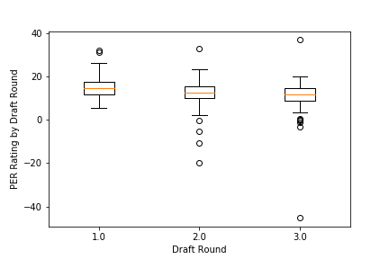

#### Superlatives
* Veteran - drafted before 2021: Nikola Jokic (112)
* Rookie - drafted in 2021: Scottie Barnes (256)
* Undrafted: Christian Wood (152)

### Biometrics
* The optimal age (25 years old), height (78 inches), and weight (214 lbs) of NBA players during the 2021-22 season were determined by finding measures of central tendency, median (age) and mean (height and weight).
* There was weak correlation between age, height, or weight versus performance.

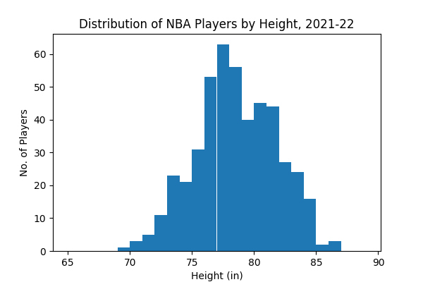
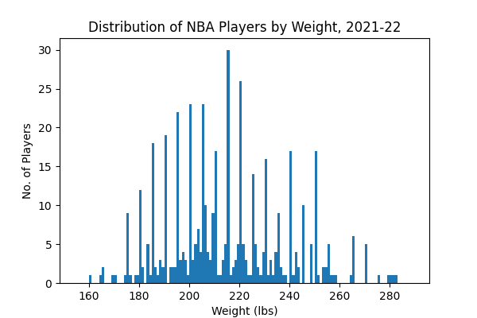
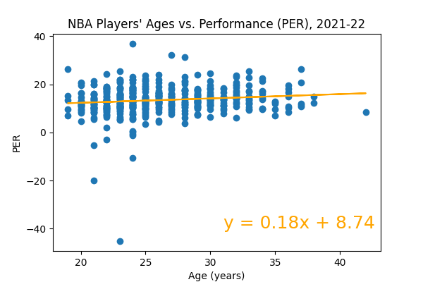
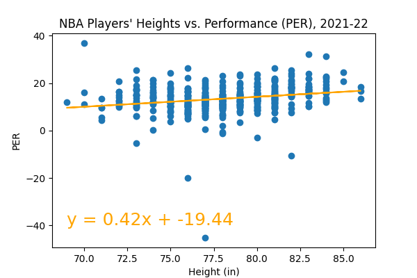
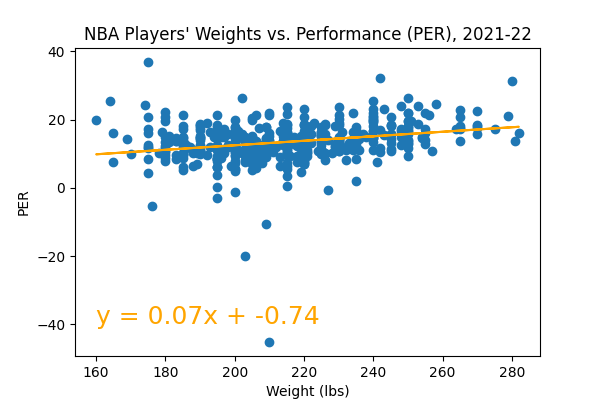

### Birthplace and College: City and Country of Origin
* There is a slight relationship between player performance and their origin. 
* At least one of the top 10 players in the NBA during the 2021-22 season (according to PER) originated from the top college or country by representation.

#### College
* Of 173 colleges attended by NBA players...
* Most players attended the University of Kentucky, including the 9th ranked player in the top 10.

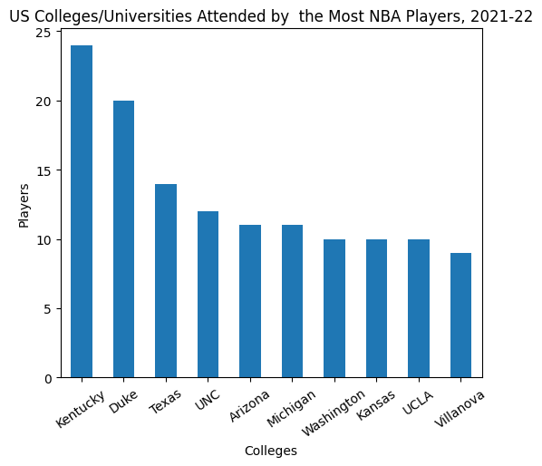
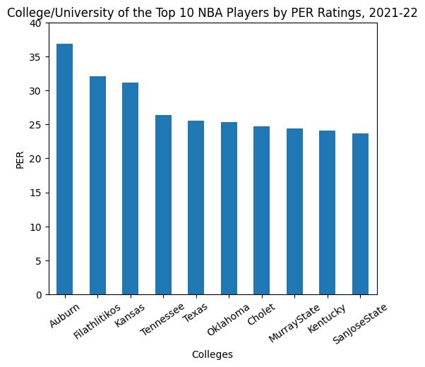

#### Birth: US City
* Of 227 US cities where NBA players were born...
* Most players were born in Los Angeles, California, though none of the top 10 players did.

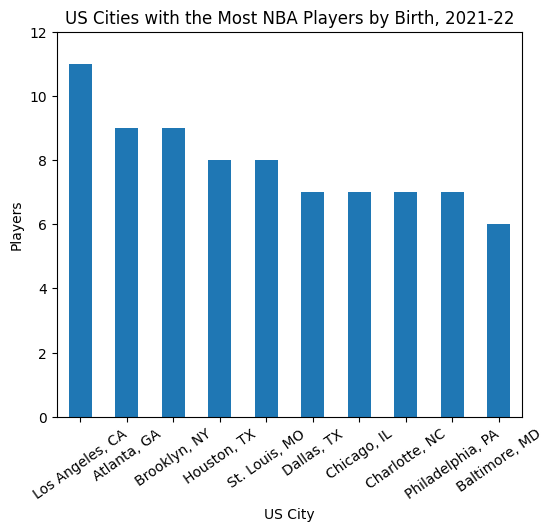
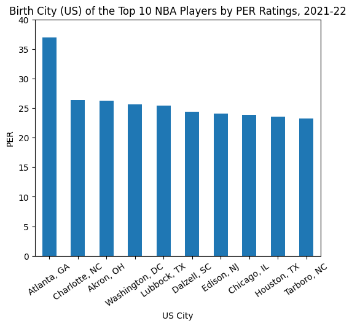

#### Birth: Country
* Of 39 countries where NBA players were born (not including the US)...
* Most players were born in Canada

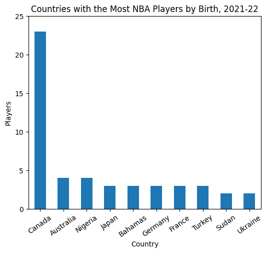
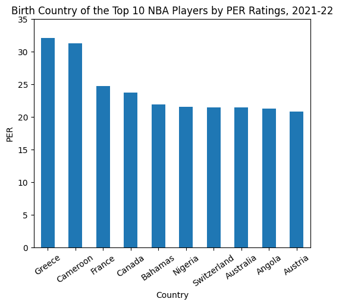

### Salary Distributions
* The vast majority of NBA players are paid between $1-18 million, with the most recieving an annual salary between $1-9 million.
* There does not appear to be much variance for salary across different positions, though there are certain positions that have a greater number of highly paid players.

### PER vs Salary
* Hypothesis: Team salary will be more indicative of team success than an averaged PER rating of team
  - There is a positive correlation between PER and salary.
* There are numerous outliers of PER Rating per Salary Rating in the $1-9 million salary range, the average range of salary for NBA players during the 2021-22 season.
  - It is reasonable to assume that positive outliers may end up in higher salary ranges in future seasons and negative outliers may drop to the league minimum range.
* Only 5 players make the league minimum, under $1 million.
* Joel Emblid (PER = 31.2) is the only positive outlier for players making >$18 million a year.
* Stephen Curry is the highest paid NBA player, with a salary >$45 million.

### Can you buy a winning team?
* There is a greater positve correlation between win percentage and team salary (0.43) as opposed to win percentage and team PER rating (0.28)
* Further analysis of PER ratings and salary over the span of a player's career would be of further value.

